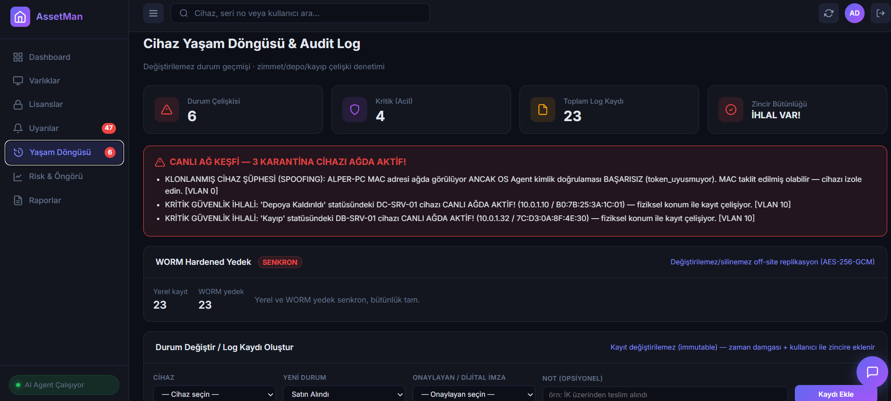
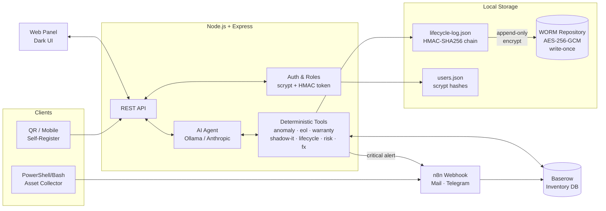
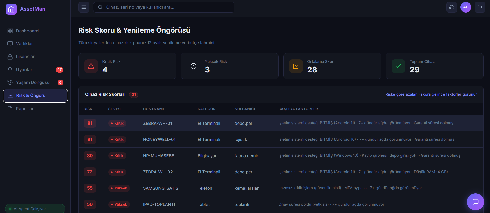
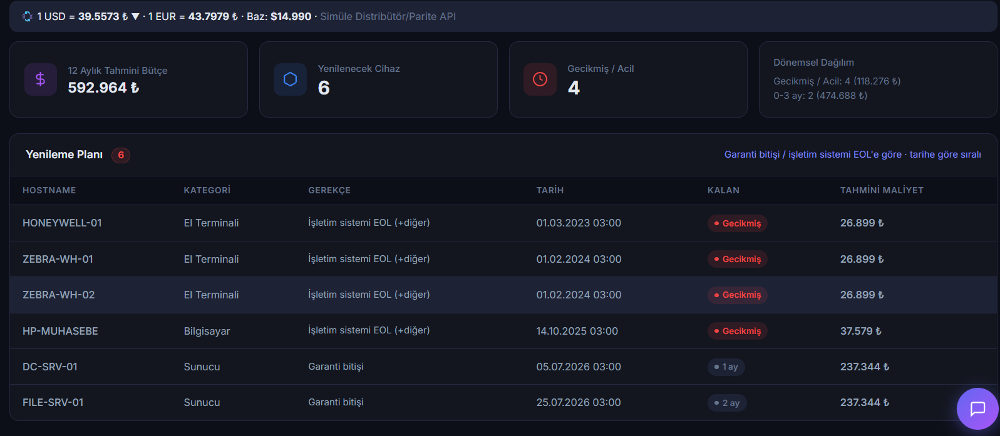
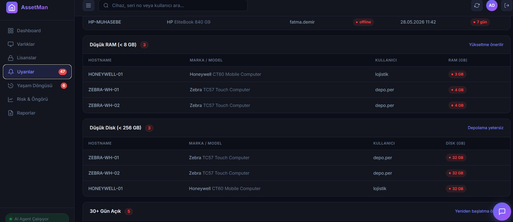

<div align="center">

# AssetMan

**Kurumsal IT envanteri için AI destekli denetim & güvenlik platformu**

Değiştirilemez audit log · çift dijital onay · canlı ağ savunması · döviz endeksli FinOps

[](https://nodejs.org)
[](https://expressjs.com)
[](#test)
[](./LICENSE)
[]()

</div>

---

<p align="center">
  
</p>

## Niçin AssetMan?

Piyasadaki çoğu envanter aracı (Snipe-IT, Lansweeper, GLPI) cihazın **son durumunu** tutar. AssetMan ise durumu *kim, ne zaman, neden, hangi yetkiyle değiştirdi*'yi **değiştirilemez (immutable)** olarak tutar — ve gerçek dünyadaki manipülasyon senaryolarını teknik olarak imkânsız kılar:

- Bir IT personeli "ben onaylamıştım" diyemez → her kritik değişiklik **iki kişinin kriptografik imzasını** taşır
- Bir yönetici "log'u sildim" diyemez → hash zinciri kopar, WORM yedek canlı kalır
- Bir saldırgan MAC adresi taklit etse bile → OS Agent el sıkışması başarısız olur, "klonlanmış cihaz" alarmı düşer
- Depodaki cihaz gizlice ağa bağlansa → 90 saniye içinde Telegram alarmı

## Özellikler

<table>
<tr>
<td width="50%" valign="top">

### Envanter & Tespit
- Otomatik cihaz toplama (Windows/Linux client)
- Anomali tespiti (RAM/disk/uptime)
- EOL işletim sistemi taraması
- Garanti takibi
- Shadow IT / kayıt dışı cihaz keşfi
- Lisans uyum denetimi

</td>
<td width="50%" valign="top">

### Audit & Güvenlik
- **HMAC-SHA256 hash zinciri** (tamper-evident)
- **Çift onay** (dual-authorization) + tek kullanımlık link
- **Kişi-bazlı dijital imza** (AD UPN + IP + MFA gömülü)
- **WORM hardened yedek** (AES-256-GCM, write-once)
- Çok-kullanıcılı auth (scrypt + roller)
- Atomik yazma (çökme dayanıklı)

</td>
</tr>
<tr>
<td valign="top">

### Kurumsal Ağ
- **VLAN-segmentli asenkron tarama** (worker pool + throttle)
- **OS Agent handshake** — MAC spoofing kalkanı
- Karantina cihaz canlı tespit
- Network Discovery scheduler

</td>
<td valign="top">

### FinOps & AI
- **Döviz endeksli bütçe** (USD/EUR-TRY canlı parite)
- 12 aylık yenileme öngörüsü (EOL + garanti birleşik)
- Cihaz risk skoru (0-100, çok kaynaklı)
- AI agent (Ollama / Anthropic) — deterministik tool kullanımı

</td>
</tr>
</table>

## Mimari



## Ekran Görüntüleri

<table>
<tr>
<td align="center" width="33%">
  <a href="docs/screenshots/risk-scores.png"></a>
  <br/><b>Risk Skorları</b><br/>Çok-kaynaklı sinyallerden 0-100 puan, MFA bypass etiketi
</td>
<td align="center" width="33%">
  <a href="docs/screenshots/forecast.png"></a>
  <br/><b>Döviz Endeksli Bütçe</b><br/>Canlı USD/EUR parite · 12 aylık yenileme planı
</td>
<td align="center" width="33%">
  <a href="docs/screenshots/alerts.png"></a>
  <br/><b>Uyarılar</b><br/>EOL · Düşük RAM/Disk · Uzun Uptime · Lisans · Shadow IT
</td>
</tr>
</table>

## Kurulum

```bash
# 1. Klonla
git clone https://github.com/alpercevizz/asset-management.git
cd asset-management

# 2. Bağımlılıkları yükle
npm install

# 3. Yapılandırma
cp .env.example .env
# .env içindeki değerleri doldur (Baserow, AI provider, secrets)

# 4. Sunucuyu başlat
npm start
# Dashboard: http://localhost:3000
```

İlk açılışta `data/users.json` tohumlanır. Demo kullanıcı parolaları **rastgele üretilip console'a yazılır** (bir kez gösterilir, kaydedin). Kendi parolanızı belirlemek için `.env`'ye `USER_PW_<USERNAME>=...` ekleyin.

### Yapılandırma (.env)

| Değişken | Açıklama |
|---|---|
| `AI_PROVIDER` | `ollama` veya `anthropic` |
| `OLLAMA_URL` / `OLLAMA_MODEL` | Yerel/uzak Ollama uç noktası |
| `ANTHROPIC_API_KEY` | Claude API anahtarı (anthropic ise) |
| `BASEROW_API_URL` / `BASEROW_API_TOKEN` / `BASEROW_TABLE_ID` | Baserow erişimi |
| `SESSION_SECRET` | Oturum cookie HMAC (zorunlu, ≥32 karakter) |
| `CHAIN_SECRET` | Audit log HMAC zincir sırrı (ayrı tutulması önerilir) |
| `WORM_SECRET` | WORM AES-256-GCM anahtar türetimi |
| `APP_PASSWORD` / `USER_PW_*` | Tohum kullanıcı parolaları (boşsa rastgele üretilir) |
| `APPROVAL_TTL_MS` | Dijital onay bekleme süresi (ms, varsayılan 24 saat) |
| `N8N_NOTIFY_WEBHOOK_URL` | Bildirim webhook adresi |
| `DISCOVERY_CONCURRENCY` / `DISCOVERY_BATCH_SIZE` | Ağ keşfi ölçek parametreleri |

> **PRODUCTION:** `NODE_ENV=production` iken zayıf/varsayılan/kısa (<32) secret tespit edilirse sunucu **başlamaz** (`checkSecrets`).

## Roller & Yetki Modeli

| Rol | Yetki |
|---|---|
| `admin` | Tüm işlemler — kullanıcı yönetimi, kayıt, onay |
| `it` | Cihaz durumu değiştirme, log oluşturma (submitter) |
| `approver` | Kritik değişiklikleri dijital olarak onaylama (ikinci imza) |

Kritik durumlar (`Zimmet Değişikliği`, `Depoya Kaldırıldı`, `Kayıp`, vb.) **iki ayrı kişi** gerektirir — submitter ile approver aynı kişi olamaz. Bu kural backend'de enforce edilir.

## Test

```bash
npm test
```

Node'un yerleşik test runner'ı (`node:test`) — dış bağımlılık yok. Çekirdek IP'yi kapsar:

- Scrypt parola hash & rol yetkilendirmesi
- HMAC zincir + tamper tespiti
- Dijital imza & forgery koruması
- Onay akışı (pending / approve / self-reject / expire / renew)
- `sameDevice` (asset_id rename dayanıklılığı)
- WORM yedekleme + AES roundtrip + kurtarma
- OS Agent handshake (spoofing tespiti)
- Döviz dönüşümü

## Client Script

**Windows:**
```powershell
.\client-scripts\windows\collect-assets.ps1 -WebhookUrl "http://localhost:3000/api/webhook"
```

**Linux/macOS:**
```bash
ASSET_WEBHOOK_URL="http://localhost:3000/api/webhook" ./client-scripts/linux/collect-assets.sh
```

### Zamanlanmış Görev (Windows)
```powershell
$action  = New-ScheduledTaskAction -Execute "powershell.exe" -Argument "-NonInteractive -File C:\Path\collect-assets.ps1"
$trigger = New-ScheduledTaskTrigger -RepetitionInterval (New-TimeSpan -Hours 6) -Once -At (Get-Date)
Register-ScheduledTask -TaskName "AssetCollector" -Action $action -Trigger $trigger -RunLevel Highest
```

## Baserow Tablo Şeması

| Alan | Tip | Notlar |
|---|---|---|
| `hostname` | Text | |
| `serial_number` | Text | Stabil cihaz kimliği (rename'e dayanıklı) |
| `brand` / `model` / `cpu` / `os` | Text | |
| `cpu_cores` / `cpu_threads` / `ram_gb` / `storage_gb` / `gpu_ram_gb` / `uptime_days` | Number | |
| `ip_address` / `mac_address` | Text | Ağ keşfi için |
| `username` | Text | Atanan kullanıcı |
| `status` | Text | `online` / `offline` / `depoda` |
| `last_seen` | Text (ISO) | Son ağ teması |
| `category` / `location` / `domain` | Text | Sınıflandırma |
| `warranty_expiry` | Date (ISO) | Garanti takibi için |

## API Endpoint'leri (özet)

| Endpoint | Rol | Açıklama |
|---|---|---|
| `POST /api/login` | public | Oturum aç |
| `GET /api/me` | auth | Kullanıcı bilgisi |
| `GET /api/assets` / `stats` | auth | Envanter |
| `POST /api/webhook` | public | Cihaz toplama (client scripts) |
| `GET /api/anomalies` · `eol-os` · `warranty` · `shadow-it` | auth | Deterministik tespit |
| `POST /api/lifecycle/event` | it / admin | Durum değişikliği talebi |
| `GET /api/lifecycle/approve?token=` | approver | Dijital onay (tek kullanımlık link) |
| `POST /api/lifecycle/renew` | it / admin | Onay talebini yenile |
| `GET /api/lifecycle/{log,conflicts,verify}` | auth | Audit log & doğrulama |
| `GET /api/network/scan` | auth | VLAN-segmentli canlı ağ keşfi |
| `GET /api/backup/status` · `POST /api/backup/restore` | auth | WORM yedek |
| `GET /api/risk-scores` · `forecast` | auth | Risk & FinOps |
| `POST /api/chat` | auth | AI agent sohbeti |

## Bilinçli Sınırlar (dürüst kapsam)

Demo'dan production'a geçişte canlıya alınması gereken üç entegrasyon dikişi simüle çalışır:

- **AD/LDAP**: `auth/users.js` ile yerel kullanıcı tablosu — gerçekte LDAP/AD sorgusuyla beslenir
- **Network Discovery feed**: `data/active-devices.json` örnek besleme — gerçekte Sophos/Zabbix/arp poller
- **WORM Repository**: yerel şifreli dizin — gerçekte AWS S3 Object Lock (Compliance mode) veya Veeam Hardened Repo

Mantık ve API sözleşmeleri her üç durumda da birebir aynı kalır.

## Lisans

Detaylar için [LICENSE](./LICENSE) dosyasına bakın.
