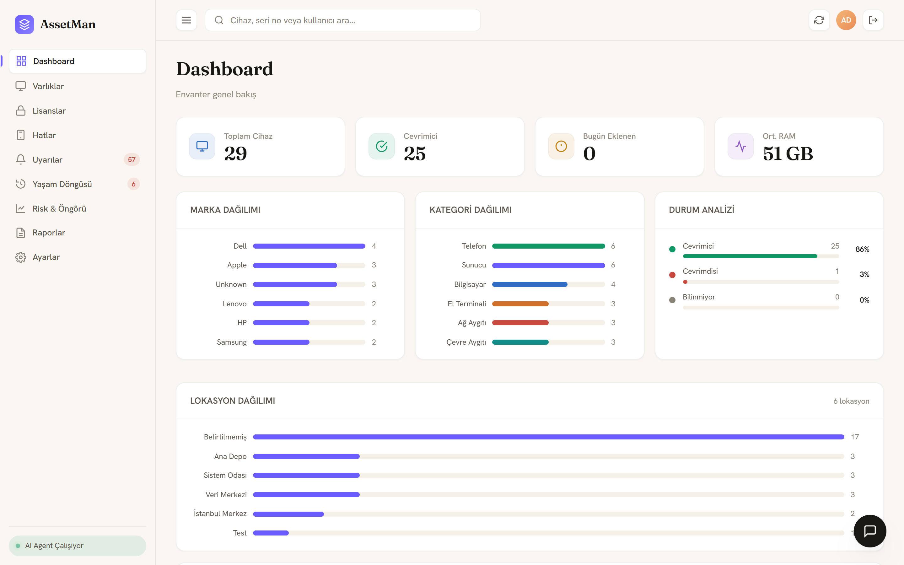
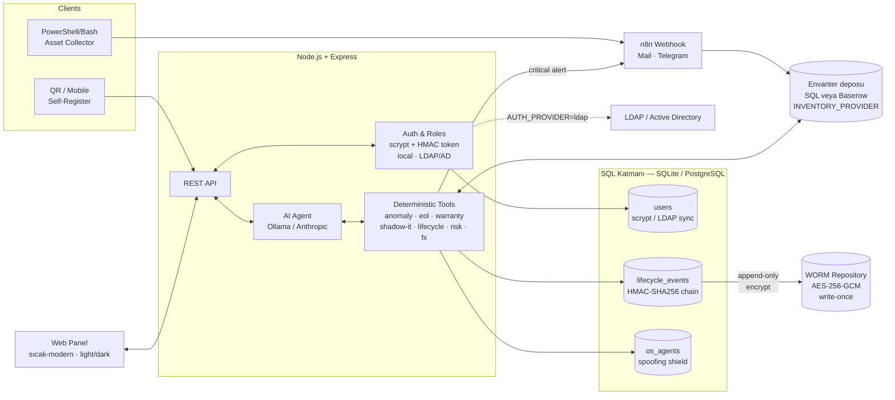
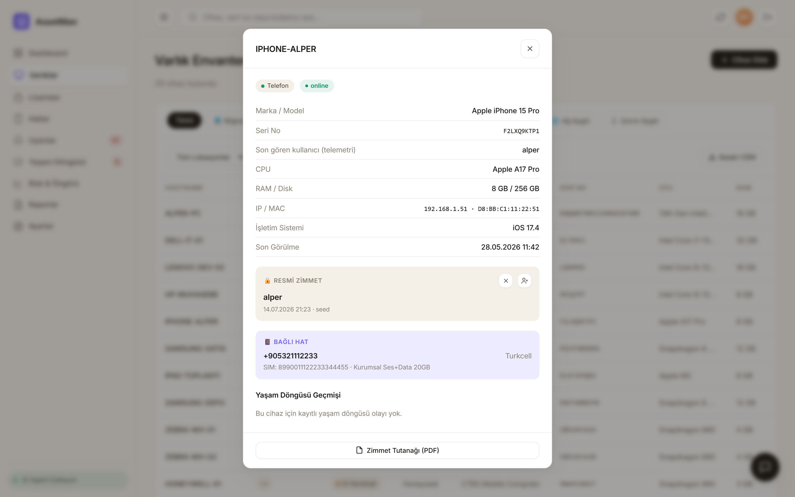
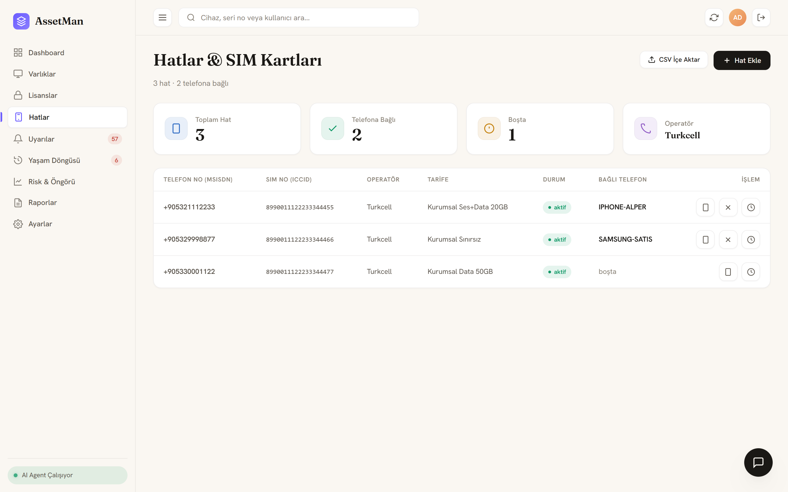
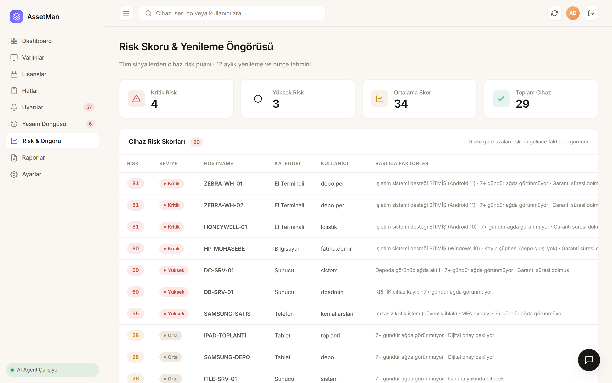
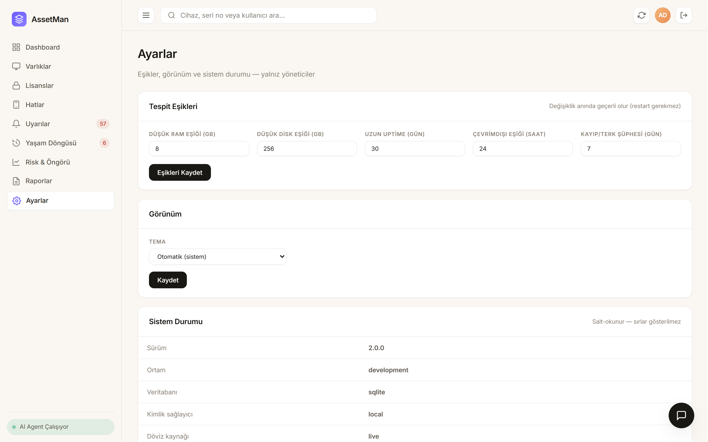

<div align="center">

# AssetMan

**Kurumsal IT envanteri için AI destekli denetim & güvenlik platformu**

Değiştirilemez audit log · çift dijital onay · gerçek AD/LDAP girişi · canlı ağ savunması · döviz endeksli FinOps

[](https://nodejs.org)
[](https://expressjs.com)
[](#kurulum)
[](#test)
[](./LICENSE)
[]()

</div>

---

<p align="center">
  
</p>

## Niçin AssetMan?

Piyasadaki çoğu envanter aracı (Snipe-IT, Lansweeper, GLPI) cihazın **son durumunu** tutar. AssetMan ise durumu *kim, ne zaman, neden, hangi yetkiyle değiştirdi*'yi **değiştirilemez (immutable)** olarak tutar — ve gerçek dünyadaki manipülasyon senaryolarını teknik olarak imkânsız kılar:

- Bir IT personeli "ben onaylamıştım" diyemez → her kritik değişiklik **iki kişinin kriptografik imzasını** taşır
- Bir yönetici "log'u sildim" diyemez → hash zinciri kopar, WORM yedek canlı kalır
- Bir saldırgan MAC adresi taklit etse bile → OS Agent el sıkışması başarısız olur, "klonlanmış cihaz" alarmı düşer
- Depodaki cihaz gizlice ağa bağlansa → 90 saniye içinde Telegram alarmı

## Özellikler

<table>
<tr>
<td width="50%" valign="top">

### Envanter & Tespit
- Otomatik cihaz toplama (Windows/Linux client)
- Anomali tespiti (RAM/disk/uptime)
- EOL işletim sistemi taraması · Garanti takibi
- Shadow IT / kayıt dışı cihaz keşfi
- Lisans uyum denetimi
- Cihaz detay & yaşam döngüsü geçmişi
- Zimmet teslim tutanağı (PDF) · Excel/CSV dışa aktarım
- Lokasyon dağılım analizi
- **Turkcell hat/SIM envanteri** — hangi hat hangi telefonda + geçmiş

</td>
<td width="50%" valign="top">

### Audit & Güvenlik
- **HMAC-SHA256 hash zinciri** (tamper-evident)
- **Çift onay** (dual-authorization) + tek kullanımlık link
- **Kişi-bazlı dijital imza** (AD UPN + IP + MFA gömülü)
- **WORM hardened yedek** (AES-256-GCM, write-once)
- **Gerçek AD/LDAP girişi** (`AUTH_PROVIDER=ldap`) — grup→rol eşleme
- **Zimmet devir koruması** — resmi zimmet kilitli, sessiz devralma engellenir
- **Lokasyon sapması** — cihaz ait olduğu yerin dışındaysa uyarı; konum geçmişi + token doğrulamalı ajan
- Çok-kullanıcılı auth (scrypt + roller) · SQL katmanı

</td>
</tr>
<tr>
<td valign="top">

### Kurumsal Ağ
- **VLAN-segmentli asenkron tarama** (worker pool + throttle)
- **OS Agent handshake** — MAC spoofing kalkanı
- Karantina cihaz canlı tespit
- Network Discovery scheduler

</td>
<td valign="top">

### FinOps & AI
- **Gerçek döviz kuru** (ECB / frankfurter.app) — önbellekli, çevrimdışı fallback
- 12 aylık yenileme öngörüsü (EOL + garanti birleşik)
- Cihaz risk skoru (0-100, çok kaynaklı)
- **Ayarlar** — eşikler UI'dan canlı düzenlenir (restart yok)
- AI agent (Ollama / Anthropic) — deterministik tool kullanımı

</td>
</tr>
</table>

## Mimari


```mermaid
flowchart LR
    subgraph Clients
      PS[PowerShell/Bash<br/>Asset Collector]
      QR[QR / Mobile<br/>Self-Register]
    end

    subgraph Server[Node.js + Express]
      API[REST API]
      AI[AI Agent<br/>Ollama / Anthropic]
      DET[Deterministic Tools<br/>anomaly · eol · warranty<br/>shadow-it · lifecycle · risk · fx]
      AUTH[Auth & Roles<br/>scrypt + HMAC token<br/>local · LDAP/AD]
    end

    subgraph SQL[SQL Katmanı — SQLite / PostgreSQL]
      USERS[(users<br/>scrypt / LDAP sync)]
      LOG[(lifecycle_events<br/>HMAC-SHA256 chain)]
      AGENT[(os_agents<br/>spoofing shield)]
    end

    WORM[(WORM Repository<br/>AES-256-GCM<br/>write-once)]
    LDAP[LDAP / Active Directory]
    BR[(Envanter deposu<br/>SQL veya Baserow<br/>INVENTORY_PROVIDER)]
    N8N[n8n Webhook<br/>Mail · Telegram]
    UI[Web Panel<br/>sıcak-modern · light/dark]

    PS --> N8N --> BR
    QR --> API
    UI <--> API
    API <--> AI
    AI <--> DET
    DET <--> BR
    DET --> LOG
    LOG -->|append-only<br/>encrypt| WORM
    API <--> AUTH
    AUTH --> USERS
    AUTH -.->|AUTH_PROVIDER=ldap| LDAP
    DET --> AGENT
    DET -->|critical alert| N8N
```

## Ekran Görüntüleri

<table>
<tr>
<td align="center" width="50%">
  <a href="docs/screenshots/device-modal.png"></a>
  <br/><b>Cihaz Detayı</b><br/>🔒 Resmi zimmet (kilitli) + telemetri ayrımı · bağlı Turkcell hattı · zimmet tutanağı
</td>
<td align="center" width="50%">
  <a href="docs/screenshots/lines.png"></a>
  <br/><b>Hatlar & SIM</b><br/>Hangi hat hangi telefonda · atama geçmişi · CSV içe aktarım
</td>
</tr>
<tr>
<td align="center" width="50%">
  <a href="docs/screenshots/insights.png"></a>
  <br/><b>Risk & Öngörü</b><br/>0-100 risk skoru · canlı ECB kuruyla 12 aylık yenileme bütçesi
</td>
<td align="center" width="50%">
  <a href="docs/screenshots/settings.png"></a>
  <br/><b>Ayarlar</b><br/>Tespit eşikleri UI'dan canlı düzenlenir (restart yok) · tema · sistem durumu
</td>
</tr>
</table>

## Kurulum

### Adım 1 — Kurulum yolunuzu seçin

| | Senaryo | Kime uygun | Ne kurulur | Süre |
|---|---|---|---|---|
| **A** | [Hızlı deneme](#kurulum-a) | Geliştirici, demo | Node.js + SQLite | ~5 dk |
| **B** | [Tek sunucu (Docker)](#kurulum-b) | Küçük/orta kurum | Docker + SQLite + Caddy TLS | ~15 dk |
| **C** | [Kurumsal on-prem](#kurulum-c) | Üretim, müşteri sahası | Docker + PostgreSQL + AD/LDAP + SNMP | ~45 dk |
| **D** | [Mevcut proxy'li sunucu](#kurulum-d) | Traefik/Nginx zaten var | C + reverse-proxy entegrasyonu | ~30 dk |

> Ortak ön koşullar: **B/C/D** için Docker 20.10+ ve `docker compose`. HTTPS istiyorsanız bir **alan adı** (DNS A kaydı sunucu IP'sine) + **80/443** portları açık.

### Adım 2 — Seçtiğiniz yolun komutları

<a id="kurulum-a"></a>

<details>
<summary><b>A — Hızlı deneme (geliştirme/demo)</b></summary>

Üretim için değildir; tek komutla ayağa kalkar, veriler `data/assetman.db` (SQLite) içinde.

```bash
git clone https://github.com/alpercevizz/asset-management.git
cd asset-management
npm install
cp .env.example .env          # varsayılanlar demo için yeterli
npm start                     # → http://localhost:3000
```

İlk açılışta kullanıcılar tohumlanır ve **parolalar bir kez console'a yazılır** — kaydedin.
Kendi parolanızı belirlemek için `.env`'ye `APP_PASSWORD=...` (admin) veya `USER_PW_<KULLANICI>=...` ekleyin.
</details>

<a id="kurulum-b"></a>

<details>
<summary><b>B — Tek sunucu (Docker + otomatik TLS)</b></summary>

Caddy, alan adınız için Let's Encrypt sertifikasını otomatik alır.

```bash
# 1) Klonla
git clone https://github.com/alpercevizz/asset-management.git
cd asset-management

# 2) Yapılandır
cp .env.example .env
nano .env
```
`.env` içinde en az şunlar:
```ini
ASSETMAN_HOST=envanter.sirket.com     # DNS A kaydı bu sunucuya bakmalı
ADMIN_EMAIL=it@sirket.com             # Let's Encrypt bildirimi
APP_PASSWORD=guclu-bir-admin-parolasi
NODE_ENV=production
DATABASE_URL=sqlite:./data/assetman.db
INVENTORY_PROVIDER=sql                # envanter de kurumda kalsın (Baserow gerekmez)
SESSION_SECRET=                       # BOŞ bırakın → ilk açılışta güçlü üretilir
CHAIN_SECRET=
WORM_SECRET=
```
```bash
# 3) Başlat
docker compose up -d
docker compose logs -f app            # "Server: http://localhost:3000" görene kadar

# 4) Doğrula
curl -sI https://envanter.sirket.com | head -3     # 200/302 dönmeli
```
Tarayıcıdan `https://envanter.sirket.com` → **admin** + belirlediğiniz parola.
</details>

<a id="kurulum-c"></a>

<details>
<summary><b>C — Kurumsal on-prem (PostgreSQL + AD + SNMP)</b></summary>

Tam kurulum: veriler kurumda, kimlik AD'den, ağ cihazları SNMP ile otomatik envantere.

```bash
# 1) Klonla + yapılandır
git clone https://github.com/alpercevizz/asset-management.git
cd asset-management
cp .env.example .env
nano .env
```
```ini
# — Alan adı & TLS —
ASSETMAN_HOST=envanter.sirket.local
ADMIN_EMAIL=it@sirket.com
NODE_ENV=production

# — Veri: her şey kurumun kendi PostgreSQL'inde —
DATABASE_URL=postgres://assetman:GUCLU-PAROLA@db:5432/assetman
DB_PASSWORD=GUCLU-PAROLA
INVENTORY_PROVIDER=sql

# — Kimlik: gerçek Active Directory —
AUTH_PROVIDER=ldap
LDAP_URL=ldaps://dc.sirket.local:636          # veya ldap://dc.sirket.local:389
LDAP_TLS_CA=/app/data/internal-ca.pem         # iç CA ise (public CA'da gerekmez)
LDAP_BIND_DN=CN=svc-assetman,OU=ServiceAccounts,DC=sirket,DC=local
LDAP_BIND_PASSWORD=servis-hesabi-parolasi
LDAP_BASE_DN=DC=sirket,DC=local
LDAP_GROUP_ROLE_MAP={"AssetMan-Admins":"admin","AssetMan-IT":"it","AssetMan-Approvers":"approver"}

# — AI: kapalı devre (veri dışarı çıkmaz) —
AI_PROVIDER=ollama
OLLAMA_URL=http://host.docker.internal:11434  # Ollama container ise host'a publish edilen port
OLLAMA_MODEL=qwen2.5:3b

# — Ağ keşfi: switch/firewall/AP/yazıcı otomatik envanter —
SNMP_ENABLED=true
SNMP_SUBNETS=192.168.1.0/24,172.16.20.0/24    # HQ + uzak şube subnet'leri
SNMP_VERSION=3
SNMP_V3_USER=assetman-ro
SNMP_V3_AUTH_KEY=...
SNMP_V3_PRIV_KEY=...

# — Sırlar: BOŞ bırakın, otomatik üretilir —
SESSION_SECRET=
CHAIN_SECRET=
WORM_SECRET=
```
```bash
# 2) Ollama (kapalı devre AI) — aynı sunucuda
curl -fsSL https://ollama.com/install.sh | sh
ollama pull qwen2.5:3b

# 3) app servisine host erişimi (docker-compose.yml → app:)
#      extra_hosts:
#        - "host.docker.internal:host-gateway"

# 4) PostgreSQL profiliyle başlat
docker compose --profile postgres up -d
docker compose logs -f app

# 5) (Baserow'dan geliyorsanız) envanteri taşı — id'ler korunur
docker compose exec app node scripts/migrate-inventory-to-sql.js

# 6) AD bağlantısını doğrula
docker compose exec app node -e "process.env.AUTH_PROVIDER='ldap'; require('./auth/ldap').authenticate('KULLANICI','PAROLA').then(p=>console.log(p||'BASARISIZ')).catch(e=>console.error(e.message))"
```

**Ayrıntılı rehberler:** [AD/LDAP runbook](./docs/LDAP-KURULUM.md) · [lokasyon ajanı runbook](./docs/LOKASYON-AJANI-KURULUM.md) · [pilot kurulum](./PILOT-KURULUM.md) · [DEPLOY.md](./DEPLOY.md)
</details>

<a id="kurulum-d"></a>

<details>
<summary><b>D — Sunucuda zaten Traefik/Nginx varsa</b></summary>

Bundled Caddy'yi **kullanmayın** (80/443 çakışır). Caddy'yi kapatıp app'i mevcut proxy'ye bağlayın:

```bash
cat > docker-compose.override.yml <<'EOF'
services:
  caddy:
    profiles: ["disabled"]
  app:
    extra_hosts:
      - "host.docker.internal:host-gateway"
    labels:
      - "traefik.enable=true"
      - "traefik.http.routers.assetman.rule=Host(`envanter.sirket.com`)"
      - "traefik.http.routers.assetman.entrypoints=websecure"
      - "traefik.http.routers.assetman.tls.certresolver=letsencrypt"
      - "traefik.http.services.assetman.loadbalancer.server.port=3000"
EOF

docker compose --profile postgres up -d
```
> `entrypoints` / `certresolver` adlarını kendi Traefik kurulumunuzdan alın:
> `docker inspect <traefik-container> --format '{{range .Args}}{{println .}}{{end}}'`
>
> Nginx/başka proxy ise: app'i `expose: 3000` ile bırakıp proxy'den `proxy_pass http://assetman-app:3000` verin.
</details>

### Adım 3 — Kurulum sonrası

```bash
# Cihazları toplamaya başlat (Windows istemci)
.\client-scripts\windows\collect-assets.ps1 -WebhookUrl "https://envanter.sirket.com/api/webhook"
```
Ardından: GPO ile yaygınlaştırma ([aşağıda](#zamanlanmış-görev-windows)) · telefon/tablet için panelden **QR self-servis** · ağ cihazları için **SNMP keşfi**.

### Bileşen seçimleri (özet)

| Bileşen | Seçenekler | Değişken |
|---|---|---|
| **Veritabanı** | SQLite (tek dosya) · PostgreSQL (kurumsal) | `DATABASE_URL` |
| **Envanter** | Baserow (no-code) · SQL (kurumda kalır) | `INVENTORY_PROVIDER` |
| **Kimlik** | Yerel scrypt · Active Directory | `AUTH_PROVIDER` |
| **LDAP taşıma** | LDAP (389) · LDAPS (636, TLS) | `LDAP_URL` şeması |
| **Yapay zeka** | Ollama (kapalı devre) · Anthropic API | `AI_PROVIDER` |
| **Döviz** | Canlı ECB · Sabit (tam izole) | `FX_PROVIDER` |

Baserow'dan SQL'e geçiş (id'ler korunur, `asset_id` bağları bozulmaz):
```bash
docker compose exec app node scripts/migrate-inventory-to-sql.js
```

### Yapılandırma referansı (.env)

| Değişken | Açıklama |
|---|---|
| `AI_PROVIDER` | `ollama` veya `anthropic` |
| `OLLAMA_URL` / `OLLAMA_MODEL` | Yerel/uzak Ollama uç noktası (Docker'da: `http://host.docker.internal:<port>`) |
| `ANTHROPIC_API_KEY` | Claude API anahtarı (anthropic ise) |
| `INVENTORY_PROVIDER` | `baserow` (varsayılan) veya `sql` (envanter SQL'de) |
| `BASEROW_API_URL` / `BASEROW_API_TOKEN` / `BASEROW_TABLE_ID` | Baserow erişimi (provider=baserow ise) |
| `DATABASE_URL` | SQL katmanı — `sqlite:...` veya `postgres://...` |
| `AUTH_PROVIDER` | `local` (scrypt) veya `ldap` (gerçek AD bind) |
| `FX_PROVIDER` | `live` (frankfurter.app/ECB) veya `static` (tam izole) |
| `SESSION_SECRET` | Oturum cookie HMAC (zorunlu, ≥32 karakter) |
| `CHAIN_SECRET` | Audit log HMAC zincir sırrı (ayrı tutulması önerilir) |
| `WORM_SECRET` | WORM AES-256-GCM anahtar türetimi |
| `APP_PASSWORD` / `USER_PW_*` | Tohum kullanıcı parolaları (boşsa rastgele üretilir) |
| `APPROVAL_TTL_MS` | Dijital onay bekleme süresi (ms, varsayılan 24 saat) |
| `N8N_NOTIFY_WEBHOOK_URL` | Bildirim webhook adresi |
| `DISCOVERY_CONCURRENCY` / `DISCOVERY_BATCH_SIZE` | Ağ keşfi ölçek parametreleri |

> **PRODUCTION:** `NODE_ENV=production` iken zayıf/varsayılan/kısa (<32) secret tespit edilirse sunucu **başlamaz** (`checkSecrets`).

### Kurulum sorun giderme

Gerçek kurulumlarda karşılaşılan sorunlar ve **kesin çözümleri**:

| Belirti | Neden | Çözüm |
|---|---|---|
| `port is already allocated` / Caddy başlamıyor | Sunucuda zaten Traefik/Nginx var (80/443 dolu) | [Senaryo D](#d--sunucuda-zaten-traefiknginx-varsa) — Caddy'yi kapat, app'i mevcut proxy'ye bağla |
| Sohbette `ECONNREFUSED ...:11434` | Ollama **container** ise 11434 iç porttur | `OLLAMA_URL`'i host'a publish edilen porta çevir (`docker ps \| grep ollama`), app'e `extra_hosts: host.docker.internal:host-gateway` ekle |
| Ollama native ama erişilemiyor | Varsayılan `127.0.0.1`'e bağlı | `OLLAMA_HOST=0.0.0.0:11434` (systemd override + restart). Portu firewall'da **dışarı açma** |
| `.env` değişti ama etkisiz | `docker compose restart` .env'i **yeniden okumaz** | `docker compose up -d` (recreate) |
| Let's Encrypt `Timeout during connect` | 80 dışarıdan kapalı (challenge başarısız) | Firewall'da **80 + 443** aç. Bulut firewall'unda (ör. Hostinger) kural uygulanmıyorsa → sunucudan **ayır/tekrar bağla** (ruleset yeniden itilir) |
| Site açılmıyor ama cert alınmış | 443 kapalı (cert 80'den alınır, tarayıcı 443 kullanır) | 443'ü aç: `Test-NetConnection <host> -Port 443` ile doğrula |
| Webhook `500` + `invalid input syntax for type integer` | PostgreSQL tip-katı; collector ondalık gönderebilir | v2.0+ ile giderildi (otomatik yuvarlama) — güncelleyin |
| `npm ci` build hatası (`Missing: ... from lock file`) | `package.json` ↔ `package-lock.json` uyumsuz | `npm install --package-lock-only` çalıştırıp lock'u commit'leyin |

LDAP/AD'ye özel sorunlar için: [docs/LDAP-KURULUM.md → Sorun giderme](./docs/LDAP-KURULUM.md).

## Roller & Yetki Modeli

| Rol | Yetki |
|---|---|
| `admin` | Tüm işlemler — kullanıcı yönetimi, kayıt, onay |
| `it` | Cihaz durumu değiştirme, log oluşturma (submitter) |
| `approver` | Kritik değişiklikleri dijital olarak onaylama (ikinci imza) |

Kritik durumlar (`Zimmet Değişikliği`, `Depoya Kaldırıldı`, `Kayıp`, vb.) **iki ayrı kişi** gerektirir — submitter ile approver aynı kişi olamaz. Bu kural backend'de enforce edilir.

## Test

```bash
npm test
```

Node'un yerleşik test runner'ı (`node:test`) — dış bağımlılık yok. Çekirdek IP'yi kapsar:

- Scrypt parola hash & rol yetkilendirmesi
- **LDAP/AD bind + grup→rol eşleme + MFA grubu** (sahte client ile, canlı AD gerekmez)
- HMAC zincir + tamper tespiti
- Dijital imza & forgery koruması
- Onay akışı (pending / approve / self-reject / expire / renew)
- `sameDevice` (asset_id rename dayanıklılığı)
- WORM yedekleme + AES roundtrip + kurtarma
- OS Agent handshake (spoofing tespiti)
- **Zimmet devir koruması** (zaten zimmetli cihaz force olmadan devralınamaz)
- **Turkcell hat/SIM** (oluştur→ata→taşı→geçmiş + MSISDN normalize)
- **Ayarlar deposu** (setSection tip-doğrulama + kalıcılık)
- Döviz dönüşümü · SQL driver seçimi

## Client Script

**Windows:**
```powershell
.\client-scripts\windows\collect-assets.ps1 -WebhookUrl "http://localhost:3000/api/webhook"
```

**Linux/macOS:**
```bash
ASSET_WEBHOOK_URL="http://localhost:3000/api/webhook" ./client-scripts/linux/collect-assets.sh
```

### Zamanlanmış Görev (Windows)
```powershell
$action  = New-ScheduledTaskAction -Execute "powershell.exe" -Argument "-NonInteractive -File C:\Path\collect-assets.ps1"
$trigger = New-ScheduledTaskTrigger -RepetitionInterval (New-TimeSpan -Hours 6) -Once -At (Get-Date)
Register-ScheduledTask -TaskName "AssetCollector" -Action $action -Trigger $trigger -RunLevel Highest
```

## Baserow Tablo Şeması

| Alan | Tip | Notlar |
|---|---|---|
| `hostname` | Text | |
| `serial_number` | Text | Stabil cihaz kimliği (rename'e dayanıklı) |
| `brand` / `model` / `cpu` / `os` | Text | |
| `cpu_cores` / `cpu_threads` / `ram_gb` / `storage_gb` / `gpu_ram_gb` / `uptime_days` | Number | |
| `ip_address` / `mac_address` | Text | Ağ keşfi için |
| `username` | Text | Atanan kullanıcı |
| `status` | Text | `online` / `offline` / `depoda` |
| `last_seen` | Text (ISO) | Son ağ teması |
| `category` / `location` / `domain` | Text | Sınıflandırma |
| `warranty_expiry` | Date (ISO) | Garanti takibi için |

## API Endpoint'leri (özet)

| Endpoint | Rol | Açıklama |
|---|---|---|
| `POST /api/login` | public | Oturum aç |
| `GET /api/me` | auth | Kullanıcı bilgisi |
| `GET /api/assets` / `stats` | auth | Envanter |
| `POST /api/webhook` | public | Cihaz toplama (client scripts) |
| `GET /api/anomalies` · `eol-os` · `warranty` · `shadow-it` | auth | Deterministik tespit |
| `POST /api/lifecycle/event` | it / admin | Durum değişikliği talebi |
| `GET /api/lifecycle/approve?token=` | approver | Dijital onay (tek kullanımlık link) |
| `POST /api/lifecycle/renew` | it / admin | Onay talebini yenile |
| `GET /api/lifecycle/{log,conflicts,verify}` | auth | Audit log & doğrulama |
| `GET /api/network/scan` | auth | VLAN-segmentli canlı ağ keşfi |
| `GET /api/backup/status` · `POST /api/backup/restore` | auth | WORM yedek |
| `GET /api/risk-scores` · `forecast` | auth | Risk & FinOps (canlı ECB kuru) |
| `GET /api/lines` · `POST /api/lines/import` | auth / it | Turkcell hat/SIM envanteri + CSV |
| `POST /api/assets/:id/assign` · `release` | it / admin | Resmi zimmet devri (409 koruma) |
| `GET /api/assets/:id/location` | auth | Beklenen + görülen lokasyon, konum geçmişi |
| `PUT /api/assets/:id/expected-location` | it / admin | Cihazın ait olduğu resmi lokasyon (kilitli) |
| `GET /api/location-drift` | auth | Lokasyon sapması (beklenen ≠ görülen, N+ gündür) |
| `GET /api/settings` · `PUT /api/settings/:section` | admin | Runtime ayarlar (eşikler, tema) |
| `POST /api/chat` | auth | AI agent sohbeti |

## Bilinçli Sınırlar (dürüst kapsam)

**AD/LDAP entegrasyonu artık gerçektir** (`AUTH_PROVIDER=ldap` — servis-bind + kullanıcı re-bind + grup→rol). Demo'dan production'a geçişte canlıya alınması gereken **iki** entegrasyon dikişi simüle çalışır:

- **Network Discovery feed**: `data/active-devices.json` örnek besleme — gerçekte Sophos/Zabbix/arp poller
- **WORM off-site**: yerel şifreli dizin write-once çalışır; off-site ayna gerçekte AWS S3 Object Lock (Compliance mode) veya Veeam Hardened Repo

Mantık ve API sözleşmeleri her iki durumda da birebir aynı kalır.

## Lisans

Detaylar için [LICENSE](./LICENSE) dosyasına bakın.
